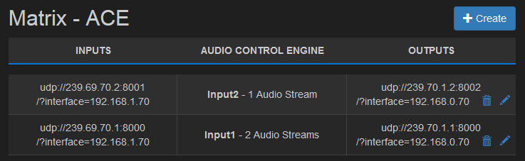

======================
Configuring Matrix ACE
======================

Matrix ACE is configured via its web user interface.

Configuration of Matrix ACE involves navigating to the main user interface landing page - the [Dashboard](Dashboard.html).

From the Dashboard each input is configured to have some or all of its audio elementary streams processed for loudness in a [Loudness Processing Workflow](LoudnessProcessingWorkflow.html).

Within each loudness processing workflow, each applicable audio elementary stream has a `Loudness Profile <LoudnessProfile.html>`_ associated with it.

The loudness profile is used to apply the loudness values configured for that profile to the processing of the audio elementary stream.

Click on the topic links below to read more detail about configuring Matrix ACE:

- `The Dashboard <Dashboard.html>`_
- `Loudness Processing Workflows <LoudnessProcessingWorkflows.html>`_
- `Loudness Profiles <LoudnessProfiles.html>`_
